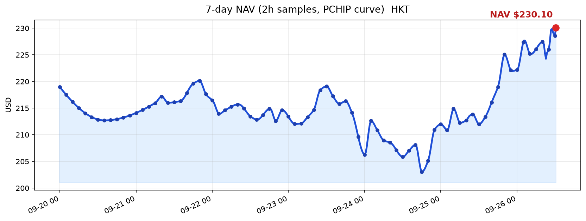

# 持倉盈虧｜淨值 ~$230.10 ~12:16 HKT（2026-09-26）

現價來源：Coinbase（AERO / PENDLE / UNI / BNB）｜現金來源：explorer 備援（BSC + Base RPC live），非 MetaMask live
錢包 `0x49BcD0991D51fD31af609eBE8c34a5d9bDB21F08`

**成本 ~$161.58　市值 ~$195.80　淨值 ≈ $230.10**
**浮盈 ＋$34.22 / ＋21.2%**（上份 12:00 ~$228.55）
**浮盈最大：AERO ＋56.3% / ＋$26.24**

| 標的 | 鏈 | 數量 | 成本價 | 成本 | 現價 | 市值 | 浮盈虧 | 浮盈% | 備註 |
| --- | --- | --- | --- | --- | --- | --- | --- | --- | --- |
| **AERO ⭐浮盈最大** | Base | 81.585 | $0.571 | **$46.58** | $0.8926 | **$72.82** | **＋$26.24** | **＋56.3%** | TP1 已做｜硬停 $0.571｜4H TL ~$0.5654 |
| PENDLE | BSC | 25.459 | $2.278 | **$58.00** | $2.5271 | **$64.34** | ＋$6.34 | ＋10.9% | 硬停 $1.94｜TP1 $2.848｜4H ~$2.382 |
| UNI | BSC | 6.090 | $9.36 | **$57.00** | $9.629 | **$58.64** | ＋$1.64 | ＋2.9% | 硬停 $7.96｜TP1 $11.70｜4H TL ~$6.873 |
| **開倉合計** |  |  |  | **$161.58** |  | **$195.80** | **＋$34.22** | **＋21.2%** |  |

**現金（explorer 備援）**
- BSC：USDT ~$9.88｜BNB ~0.003846（~$2.98）
- Base：USDC ~$21.44｜ETH ~0
- 現金合計 ~$34.31

**現金流（自上份 ~12:00）**
- 無重大現金流／無 swap

**淨值** 開倉市值＋現金 ≈ **$230.10**

出場優先：硬停 → TP1 減約成本 1/4 價值 → 4H 收市跌穿支撐清剩餘。

Notion: https://app.notion.com/p/3e750b4ad221812981cfd6d85d987e06
