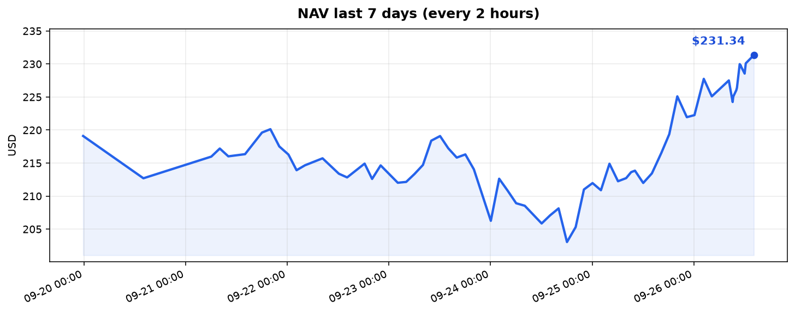

# 持倉盈虧｜淨值 ~$231.34 ~14:10 HKT（2026-09-26）

現價來源：Coinbase AERO/PENDLE/UNI/BNB｜現金來源：explorer 備援（非 MetaMask live）｜錢包 `0x49BcD0991D51fD31af609eBE8c34a5d9bDB21F08`

**成本 ~$161.58**　**市值 ~$197.04**　**淨值 ≈ $231.34**
**浮盈 ＋$35.46 / ＋21.9%**（上份 13:58 ~$230.65｜12:16 ~$230.10）

**浮盈最大：AERO ＋56.4% / ＋$26.28**
PENDLE 次 ＋11.0% / ＋$6.40。UNI ＋4.9% / ＋$2.78。硬停／TP1／4H 收市破線均未觸，無 swap。

| 標的 | 鏈 | 數量 | 成本價 | 成本 | 現價 | 市值 | 浮盈虧 | 浮盈% | 備註 |
| --- | --- | --- | --- | --- | --- | --- | --- | --- | --- |
| **AERO** ⭐浮盈最大 | Base | 81.585 | $0.571 | **$46.58** | $0.8930 | **$72.86** | **＋$26.28** | **＋56.4%** | **TP1 已做**｜硬停 $0.571｜4H TL ~$0.5686 |
| **PENDLE** | BSC | 25.45886 | $2.278 | **$58.00** | $2.5297 | **$64.40** | **＋$6.40** | **＋11.0%** | 硬停 $1.94｜TP1 $2.848 未做｜4H ~$2.402 |
| **UNI** | BSC | 6.0897 | $9.36 | **$57.00** | $9.8166 | **$59.78** | **＋$2.78** | **＋4.9%** | 硬停 $7.96｜TP1 $11.70｜4H TL ~$6.937 |
| **開倉合計** |  |  |  | **$161.58** |  | **$197.04** | **＋$35.46** | **＋21.9%** |  |

**AERO**（Base）
- **成本 ~$46.58**｜成本價 ~$0.571｜數量 81.585
- **市值 ~$72.86**｜現價 ~$0.8930（Coinbase）｜**浮盈約 ＋56.4% / ＋$26.28（最大）**
- 硬停 $0.571｜TP1 已做｜4H 支撐 ~$0.5686（水平備選 ~$0.6463）

**PENDLE**（BSC）
- **成本 ~$58.00**｜成本價 ~$2.278｜數量 25.45886
- **市值 ~$64.40**｜現價 ~$2.5297（Coinbase）｜浮盈約 ＋11.0% / ＋$6.40
- 硬停 $1.94（未觸）｜TP1 $2.848（未觸／未做）｜4H 支撐 ~$2.402（水平備選 ~$2.32）

**UNI**（BSC）
- **成本 ~$57.00**｜成本價 ~$9.36｜數量 6.0897
- **市值 ~$59.78**｜現價 ~$9.8166（Coinbase）｜浮盈約 ＋4.9% / ＋$2.78
- 硬停 $7.96｜TP1 $11.70｜4H 支撐 ~$6.937（水平備選 ~$8.787）

**開倉合計** **成本 ~$161.58**｜**市值 ~$197.04**｜**浮盈約 ＋$35.46／＋21.9%**

**現金（explorer 備援，非 MetaMask live）**
- BSC：USDT ~$9.88｜BNB ~0.003846（~$2.97）
- Base：USDC ~$21.44｜ETH ~0
- **現金合計 ~$34.30**

**現金流（自上份 ~13:58／12:16）**
- 無重大現金流／無 swap（開倉數量不變；AERO 81.585｜PENDLE 25.459｜UNI 6.090）

**淨值** 開倉市值＋現金 ≈ **$231.34**

出場優先：硬停 → TP1 減約成本 1/4 價值 → 4H 收市跌穿支撐清剩餘。
